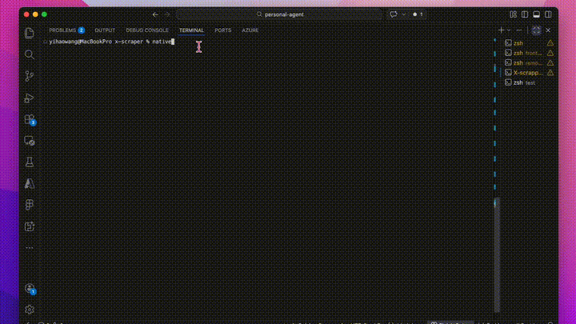

<div align="center">


# Open-Base44

**Your open-source personal app developer. Runs on your machine. Builds real apps.**

Describe what you want → Claude writes the code → Preview on your phone → Ship to App Store.

No cloud. No account. No limits. Your code stays on your machine.

[](LICENSE)
[](https://pypi.org/project/nativebot)
[](https://github.com/easonwang00/open-base44)

</div>

---

Most AI app builders give you throwaway demos. Open-Base44 gives you **real, shippable mobile apps** — built with Expo React Native, running on your phone, ready for the App Store. Not mockups. Not prototypes. Production code.

It's your **personal app developer** that lives in your terminal. It doesn't phone home. It doesn't store your code in someone else's cloud. Everything runs locally, powered by your Claude subscription. You own every line.

---

## Quick Start — 10 seconds

```bash
pipx install nativebot   # or: pip install nativebot
claude login
nativebot
```

Three commands. No API key setup. Uses your Claude subscription. Start building.

---

## See It Work

<div align="center">

</div>

## Commands — 10 sec read

```bash
nativebot                  # Interactive mode (recommended)
nativebot create "MyApp"   # Create a new project
nativebot open MyApp       # Chat with Claude about your app
nativebot preview MyApp    # Launch Expo preview on your phone
nativebot list             # List all projects
nativebot files MyApp      # Show project file tree
nativebot export MyApp     # Build & submit to App Store
nativebot telegram         # Start Telegram bot interface
nativebot delete MyApp     # Delete a project
```

## Chat From Your Phone — 15 sec read

Open-Base44 includes a self-hosted Telegram bot. Create your own private bot, run it on your machine. Build apps from your phone while you're on the couch.

```bash
# 1. Open Telegram → @BotFather → /newbot → copy token
# 2. Start the bot:
export TELEGRAM_BOT_TOKEN=your-token
nativebot telegram
```

Send photos of UI designs. Claude sees them. `/preview` gives you the Expo URL right in Telegram — open it in Expo Go, keep chatting while you preview. The chat doesn't interrupt.

Same projects, same `~/.nativebot/projects/` directory. CLI and Telegram work interchangeably.

## How It Works — 10 sec read

1. **Create** — Seeds a production-ready Expo React Native template
2. **Chat** — Describe features in plain English, Claude writes the code
3. **Self-heal** — If the build breaks, Claude auto-detects and fixes it
4. **Preview** — Scan QR with Expo Go on your phone, hot-reloads on every change
5. **Ship** — Build with EAS and submit to App Store / Google Play

## Why Open-Base44? — 15 sec read

| | Replit | Bolt | Lovable | Vibecode | **Open-Base44** |
|--|--------|------|---------|----------|------------|
| Open source | - | - | - | - | **Yes** |
| Runs locally | - | - | - | - | **Yes** |
| Your own machine | - | - | - | - | **Yes** |
| No account needed | - | - | - | - | **Yes** |
| Mobile-first (Expo) | - | - | - | Yes | **Yes** |
| Chat from phone | - | - | - | - | **Yes** |
| Free forever | - | - | - | - | **Yes** |

**The difference:** Other tools build demos in their cloud. Open-Base44 builds real apps on your machine. You own the code. You own the project. You can open it in VS Code, Cursor, or Xcode. There's no vendor lock-in because there's no vendor.

## Preview & Deploy — 10 sec read

```bash
nativebot preview MyApp          # Scan QR with Expo Go
nativebot export MyApp           # Step-by-step App Store guide
```

Or manually:
```bash
cd ~/.nativebot/projects/MyApp/mobile
npx expo start                   # Dev preview
eas build --platform ios         # Production build
eas submit --platform ios        # Ship to App Store
```

## Requirements — 10 sec read

| Requirement | Notes |
|------------|-------|
| Python 3.10+ | `python3 --version` |
| Node.js 18+ | For Expo projects |
| Claude subscription | `claude login` — no API key needed |
| Expo Go (mobile) | For live preview on phone |

## Architecture — 15 sec read

```
You (terminal/Telegram)     Open-Base44 CLI          Claude Agent SDK
┌─────────────────┐    ┌────────────────┐    ┌──────────────────┐
│ "Add login page" │───▶│ Chat + Preview │───▶│ Claude AI         │
│                  │◀───│ Self-heal      │◀───│ Reads/Writes code │
└─────────────────┘    └────────────────┘    └──────────────────┘
                              │
                       ~/.nativebot/projects/
                       ├── FitnessApp/
                       │   ├── mobile/        ← Expo React Native
                       │   ├── backend/       ← Supabase (optional)
                       │   └── .nativebot/    ← Conversation history
                       └── TodoApp/
```

- **Local-first** — projects are real directories on your filesystem
- **No cloud** — Claude edits files directly, no database, no sync
- **Session continuity** — conversations saved locally, pick up anytime
- **Your code** — open in any editor, commit to any repo

## Configuration — 10 sec read

```bash
export NATIVEBOT_PROJECTS_DIR=/custom/path    # Change project location
nativebot open MyApp --model sonnet           # Use Sonnet 4.6 (faster)
```

Default model is Claude Opus 4.6.

## Contributing

PRs welcome! See [CONTRIBUTING.md](CONTRIBUTING.md).

## License

MIT. Free forever. Go build something.

---

<div align="center">
  Powered by <a href="https://anthropic.com">Claude</a> and <a href="https://expo.dev">Expo</a>
</div>
